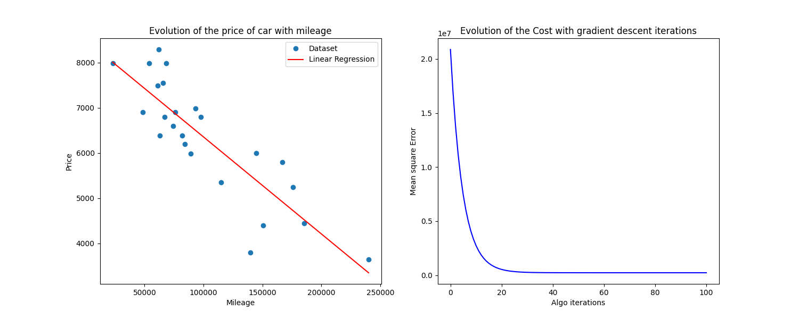

# ft_linear_regression

This project serves as an introduction to machine learning. I was tasked with coding a linear regression algorithm from scratch in Python and applying it to estimate the price of a car using mileage as the feature.



## Training.py

Takes as argument the dataset used for the training and save the linear regression parameters in a params.csv file. 

## Predict.py
Loads the linear regression parameters and ask the use the mileage of the car they want to estimate the price, then return the estimation. 

```
$> python src/predict.py
Please enter a car mileage in km : 2540
     The expected price is : 8444.86 euros
```